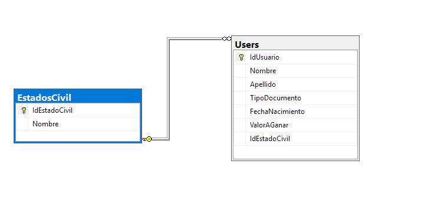

# Prueba Tecnica

Este proyecto fue desarrollado utilizando .NET 8 y SQLSERVER 2022.


# Esquema de la Base de Datos

El siguiente diagrama representa el esquema de la base de datos utilizado en este proyecto:


Tablas 

Usuarios

```sql
CREATE TABLE Users (
    IdUsuario INT IDENTITY(1,1) PRIMARY KEY,
    Nombre NVARCHAR(100) NOT NULL,
    Apellido NVARCHAR(100) NOT NULL,
    TipoDocumento NVARCHAR(2) NOT NULL,
    FechaNacimiento DATETIME NOT NULL,
    ValorAGanar DECIMAL NOT NULL,
    IdEstadoCivil INT NOT NULL,
    CONSTRAINT FK_Users_EstadosCivil FOREIGN KEY (IdEstadoCivil) REFERENCES EstadosCivil(IdEstadoCivil)
);
```

Estados Civil

```sql
use master
create table EstadosCivil(
	IdEstadoCivil INT IDENTITY(1,1) PRIMARY KEY,
	Nombre NVARCHAR(100) NOT NULL,
);
```
